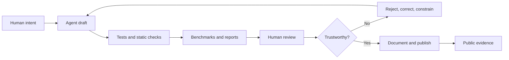

# Agents Draft. I Sign.

The obvious story about this lab is that I used AI to build it.

That is true, but incomplete. It is also the least interesting part.

The more useful story is this: I used AI agents as an execution layer while keeping engineering judgment as the control system. The code, documentation, benchmarks, CI workflows, website, and blog were all produced with agent assistance. But the quality did not come from generation. It came from constraint.

I set the problem. I rejected weak drafts. I asked whether the numbers were real. I forced the docs to match the code. I made the benchmark public. I kept the commit history clean. I owned the signature at the bottom.

Agents draft. I sign.

## The Experiment

I am running a practical experiment in software engineering:

Can a single principal engineer, working with AI agents, produce public artifacts that hold up under review?

Not demos. Not throwaway prototypes. Artifacts another engineer can inspect, run, challenge, and improve:

- Repositories with tests, type checks, linters, and secret scanning.
- Gold datasets with deterministic validation.
- Benchmark reports with explicit metrics and latency numbers.
- Documentation that explains the architecture, not just the commands.
- Blog posts that describe the failures as clearly as the wins.

The hypothesis is not that AI replaces engineering discipline. The hypothesis is the opposite: AI output becomes useful only when discipline is made explicit.

Without that discipline, agents generate volume. With it, they can help build systems.

## The Control Loop

The working model looks like this:

The important box is not "Agent draft." That is the cheap part now.

The important box is "Trustworthy?" That is where engineering still happens.

In this lab, an agent can write a CI workflow, but the workflow has to run the real tests. It can draft a benchmark report, but the benchmark has to survive scrutiny. It can write a blog post, but the post cannot invent a result because it sounds good.

Generation is not the standard. Evidence is.

## Evidence 1: Green Was Not Enough

The first lesson came from `text-compressor`.

I wanted to compress long YouTube transcripts before embedding them. The first evaluation path looked promising: ModernBERT-style semantic similarity gave the summaries high scores. The cells were green.

That should have been the end of the story.

It was not.

Semantic overlap is not faithfulness. A summary can reuse the right nouns, preserve the right vibe, and still change the relationship between the facts. For a recommender that uses compressed text downstream, that is poison. A plausible summary is worse than an obviously broken one because it carries confidence into retrieval.

So I stopped treating one metric as proof. I kept ModernBERT as a useful signal, but I demoted it. I added numeric checks, NLI-style faithfulness, and entity coverage. That decision moved the lab from "the model sounds right" to "the model preserved the facts I care about."

The agent helped implement the machinery. It did not decide what deserved trust.

## Evidence 2: The Benchmark Was Wrong Until It Was Measured

The same pattern repeated in `ner-detector`.

I built a pluggable NER harness because ArticleRecommender needed to extract technologies from articles, talks, and papers. I compared pattern matching, BERT-family models, GLiNER/NuNER, and LLM extraction. The headline metric became Document-Level F1 because the product needs salient entity recognition, not perfect academic span matching.

Then the benchmark started lying in subtler ways.

The transformers backend was slow because the model was being reloaded too often. Dataset paths and label mappings made results look worse than they were. A benchmark report can be beautifully styled and still be wrong.

That is the uncomfortable part of AI-assisted work: agents can produce the shape of a professional artifact before the artifact has earned professional trust.

The fix was not a better prompt. It was engineering:

- Cache the backend correctly.
- Validate dataset paths.
- Fix label mapping.
- Run repeatable benchmarks.
- Publish the report where others can inspect it.

After that, the numbers became useful: LLM extraction was stronger on some datasets but took seconds per document; BERT was weaker but fast enough for interactive paths. The right answer was not "use AI everywhere." The right answer was routing based on measured trade-offs.

## Evidence 3: The Gold Data Could Not Be Patched by Vibes

The cleanest example is `ner-gold-generator`.

The naive approach to NER gold data is simple: ask an LLM to read a document and return entities with character offsets. I tried the shape of that solution. It failed for a basic reason: LLMs are bad at exact character counting.

There was an easy agentic trap available there. I could have asked for fuzzy matching. I could have accepted "close enough" spans. I could have written repair logic that made bad gold data look clean.

I did not.

I inverted the system.

The code chooses entities first. The LLM writes text that must contain those entities exactly once. Deterministic validation checks the output. Deterministic code computes offsets. If the generated document fails validation, it is retried or dropped.

That design is the whole philosophy of the lab in miniature:

Let the model do what it is good at. Make code own the invariants.

## Evidence 4: The Blog Is Part of the System

This blog was also built with agents.

That creates a different risk. Code can fail tests. Benchmarks can expose bad numbers. Prose fails more quietly. It can become generic. It can overclaim. It can turn a messy engineering path into a clean marketing arc.

So I made rules for the narrative too:

- First person. I made the decisions; I own the calls.
- No invented metrics.
- No "we" unless there is a named collaborator.
- One story per post, not a changelog.
- Reality only: point to code, reports, CI, datasets, or recorded decisions.

That is why this series includes the embarrassing parts: regex-based entity extraction, misleading similarity scores, cache bugs, LLM offset hallucinations, CI gaps, and security hardening after a credential scare.

The public narrative is not decoration around the engineering work. It is another artifact under the same rule: claims need evidence.

## What AI Changed

AI changed the economics of iteration.

It let me move across repos quickly. It helped scaffold packages, wire CI, draft docs, produce diagrams, generate static pages, inspect transcripts, and turn a trail of work into a readable series. A single engineer could sustain a wider surface area than would have been practical by hand.

But AI did not remove the hard parts.

The hard parts were choosing the metric, noticing when a result was too convenient, deciding when to split a repo, refusing fuzzy gold data, keeping public docs accurate, and asking whether a token in the local keyring was visible to an agent with shell access.

Those are not typing problems. They are judgment problems.

AI made the loop faster. It did not make the loop optional.

## The Engineering Bar

The operating standard for marfago-labs is intentionally boring in the best sense:

- Tests and coverage gates where behavior is implemented.
- Static checks and linters in CI.
- Secret scanning.
- Deterministic validators for persisted benchmark data.
- Public reports for claims about quality and latency.
- Docs that explain how to reproduce the result.
- Blog posts that admit the failed assumptions.

That standard matters because agent output can look finished before it is finished. The screen fills with code. The report renders. The README sounds confident. The danger is accepting the appearance of completion.

The antidote is mechanism.

## What I Am Claiming

I am not claiming that this lab proves agents can replace engineers.

I am claiming something narrower and more useful:

A disciplined engineer can use agents to produce high-quality public artifacts faster, if the work is constrained by explicit intent, repeatable checks, honest metrics, and human accountability.

That is the experiment.

`marfago-labs` is the evidence trail: the code, the datasets, the reports, the CI, the docs, the blog, and the history that shows how many times the agent output had to be corrected before it deserved trust.

The lesson I am taking back to ArticleRecommender is simple.

Do not automate judgment away. Automate the work around judgment so there is more room for it.

**Previous:** [Publishing the Evidence](./06-publish-the-evidence-loop.md) · **Series index:** [Building an Evaluation Lab by Accident](./00-series-index.md)

***

## The Evidence

- **Dataset Stats:** [marfago-labs.github.io/ner-dataset](https://marfago-labs.github.io/ner-dataset/)
- **Benchmark Report:** [marfago-labs.github.io/ner-detector](https://marfago-labs.github.io/ner-detector/)
- **The Code:** [ner-gold-generator](https://github.com/marfago-labs/ner-gold-generator) · [ner-dataset](https://github.com/marfago-labs/ner-dataset) · [ner-detector](https://github.com/marfago-labs/ner-detector)
